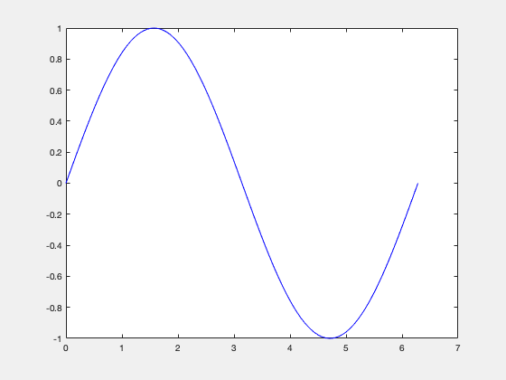

# GIFWriter for Matlab
Quickly create GIF animations in Matlab

## Usage
- Add `gifwriter.m` to your path
- Insert `gifwriter` after every plot.
- Run your file and your gif animation is saved as `myanimation.gif`.

## Example
```matlab
x = linspace(0, 2*pi);
for theta = 0:pi/16:pi
  plot(x, sin(x-theta),'b' );
  gifwriter
end

for theta = pi:-pi/16:0
  plot(x, sin(x-theta), 'r' );
  gifwriter
end
```



## Optional controls
Choose filename or delaytime by including the following in your preamble.

```matlab
%%% GIF WRITER CONTROLS
giffilename = './my_gif_filename.gif'; % Name of the gif file
gifdelaytime = 0.3; % delay time between each image
giftrigger = 1; % Trigger that replaces existing gif if 1 or appends if 0
writegif = 1; % Whether or not to save gif. Toggle this off to stop writing gifs.
%%% END GIF WRITER CONTROLS
```

## License
MIT License
Vivek T Ramamoorthy
February 2022

